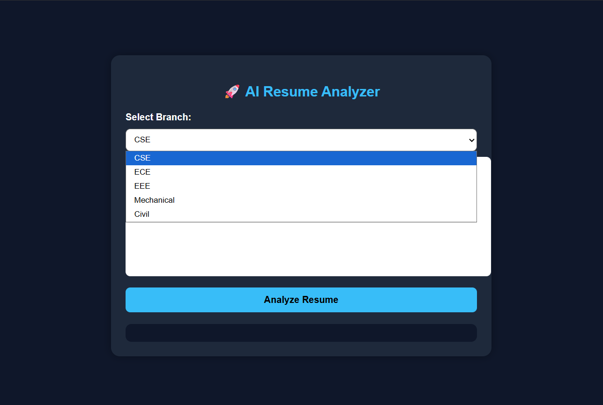
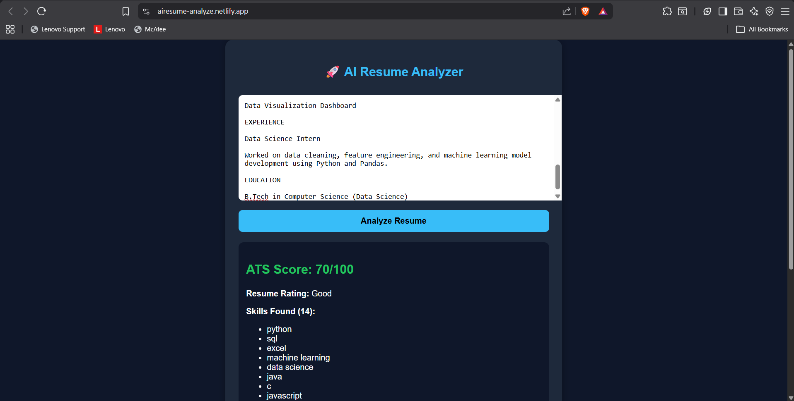
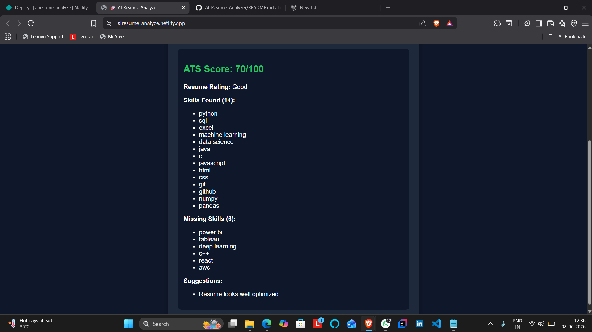

# AI Resume Analyzer

🚀 Day 1 of my 30 Days 30 AI Websites Challenge

AI Resume Analyzer is a simple web application that evaluates resume text and provides an ATS-style score based on detected skills and keywords.

## 🌐 Live Demo

Demo Link:

https://airesume-analyze.netlify.app/

## 📸 Screenshots

## ✨ Features

* ATS Score Calculation
* Skill Detection
* Missing Skills Identification
* Resume Improvement Suggestions
* Modern Responsive UI

## 🛠 Technologies Used

* HTML
* CSS
* JavaScript
* AI-Assisted Development

## 📋 How It Works

Paste resume text and receive:

* ATS Score
* Skills Found
* Missing Skills
* Suggestions

## 🎯 Challenge

This project is part of my **30 Days 30 AI Websites Challenge**, where I build and publish one AI-assisted website every day.

### Progress

* Day 1 ✅ AI Resume Analyzer

## 👨‍💻 Author

Anand,

B.Tech CSE (Data Science)
